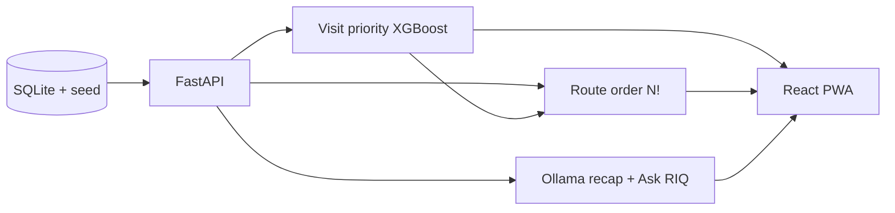

# RouteIQ — Hackathon pitch (copy for Canva / PowerPoint)

**Tip:** Keep maroon (`#8B1538` / `#D2051E`), white, and black. Use your Hilti mascot on the title and closing slides.

**Official logo file:** `frontend/src/assets/logo.png` — upload it into Canva (or place it top-left on slide 1 like your template).

---

## Slide 1 — Title

**RouteIQ**  
*AI sales visit copilot for Hilti field teams*

**Hackathon pitch · 2026**  
From territory data to the right stops, the right notes, and clearer future potential.

*[Visual: `logo.png` top-left + mascot on the right. Subtle route line or map pin motif.]*

---

## Slide 2 — The problem

**Field sales run on partial information**

- Reps optimize **drive time**, not **visit value** — spreadsheets don’t live in the car.
- **Visit outcomes** stay stuck in heads or messy notes — hard for managers to see pipeline truth.
- **CRM scores** alone miss the story of *what just happened on site*.

**We asked:** What if every day’s route — and every conversation — made the next decision smarter?

---

## Slide 3 — Solution (one line)

**RouteIQ = the most valuable route, not just the shortest.**

Three things in one mobile PWA:

1. **Today + map** — prioritized stops, distance, expected return, one-tap navigate.
2. **AI in the field** — voice note → structured recap; Ask RouteIQ for grounded answers.
3. **Manager view** — “before CRM-only” vs “after real visits & recaps” on future potential.

---

## Slide 4 — Rep experience: the day

**Built for how reps actually work**

| They need…              | RouteIQ gives…                                      |
|-------------------------|-----------------------------------------------------|
| Where to go next        | Value-ranked day plan + map                         |
| Proof in the moment     | Expected return + impact framing per stop           |
| Fast logging            | Speak a note → AI recap (outcome, next step, etc.)  |
| Help without guesswork  | Ask RIQ — grounded on *this* territory / customer   |

*[Screenshot placeholder: Today screen + Map.]*

---

## Slide 5 — Intelligence layer

**Not just routing — *value-aware* routing**

- **RouteIQ score** blends pipeline, history, and product fit (XGBoost visit likelihood + explanations for the demo).
- **Optimizer** builds a practical stop order for the day (travel + return tradeoff).
- **Differentiator:** Google Maps gets you there; RouteIQ tells you **why this stop matters now**.

### Architecture diagram — polished (three columns, same as your slide)

Use this as **replace text** on your existing diagram so judges read it in one pass: **phone app → API + intelligence → data**. One short footer ties it together.

**Footer (one line, under the three columns):**  
*The PWA calls RouteIQ over REST. The map uses OSRM + CARTO tiles directly in the browser.*

#### Column 1 — **Mobile PWA** (React · TypeScript · Vite)

| Block | Say this (short) |
|--------|------------------|
| **Today** | Ranked stops + day impact summary |
| **Map** | MapLibre + live GPS + stop markers |
| **Customer** | Score + “why” · history · log visit / recap |
| **Settings** | Switch rep · **Manager dashboard** (team before/after, spotlight account) |
| **Hooks** | `useGeolocation` · `useTurnByTurn` (Web Speech for turn prompts) |
| **↘ dashed** | **OSRM** — driving route geometry & steps *(called from the app, not FastAPI)* |

#### Column 2 — **FastAPI** (Python)

| Block | Say this (short) |
|--------|------------------|
| **Wire** | REST + JSON (`DayPlan`, `OptimizationSummary`, customers, visits, …) |
| **Routes** | e.g. `/salespeople/.../day-plan`, `/customers`, `/visits`, `/admin/dashboard` |
| **`build_day_plan()`** | Load territory → **score** → **order stops** → attach **focus line** per stop |
| **Prioritization** | **XGBoost** visit likelihood + short explanations *(heuristic fallback if model not seeded)* |
| **Routing** | Value-aware **greedy pick**, then **best ordering** by trying permutations for the day’s N stops (e.g. **8! ≈ 40k** orders when N ≤ 9) |
| **Explainer** | One-line “why this stop now” from customer context |
| **Field AI** | **Ollama** — voice → structured recap · **Ask RIQ** on your data |

**Diagram fix vs. older version:** base map **CARTO (Positron) / OSM** is loaded by **MapLibre in the PWA**, not by the Python server — draw that arrow from **Map** to **tiles**, not from FastAPI.

#### Column 3 — **Data**

| Block | Say this (short) |
|--------|------------------|
| **SQLite** | Territories, salespeople, customers, `visit_history`, orders |
| **SQL** | Backend reads/writes through one DB file (demo path) |
| **Seed** | Synthetic CSV generator → `seed_database` → DB + **trained XGB artifacts** next to the DB |

#### 10-second narration

“Reps use one installable app. FastAPI scores and orders their day from SQLite, with ML for *who* and brute-force ordering for *sequence* on a small N. The map layer talks to OSRM and CARTO in the browser; optional Ollama powers recap and Ask RIQ.”

---

### One-row pipeline (optional second slide / appendix)

**External (browser only):** OSRM · CARTO basemap → **Map** inside `APP`.

---

## Slide 6 — Voice recap & Ask RIQ

**Turn voice into structure; turn questions into answers**

- Rep records a **short voice note** after the visit.
- Backend uses an **LLM (Ollama)** to extract structured recap fields — aligned with how managers review accounts.
- **Ask RouteIQ** answers from app data — less hallucination, more “what should I do here?”

**Pitch line:** *The CRM gets the truth without another form.*

*[Screenshot placeholder: Customer detail + recap.]*

---

## Slide 7 — Manager dashboard (hackathon story)

**From “static territory” to “living pipeline”**

- **Before:** Future potential from CRM / territory signal alone — useful but **cold**.
- **After:** Same accounts with **recent visit outcomes + structured recaps** — score reflects **satisfied visits** and next steps.
- **Why it’s credible:** Explicit weights for outcomes; bonus for recap rows and structured `next:` lines — judges can trace the logic.

*[Screenshot placeholder: Manager “before / after” meters.]*

---

## Slide 8 — Tech stack (build credibility fast)

**Modern, demo-friendly**

- **Frontend:** React + TypeScript PWA (installable, phone-first).
- **Backend:** FastAPI, SQLite demo dataset (KL-style territories, ~400 customers).
- **Maps / routing:** MapLibre + routing integration for visual proof.
- **AI:** Ollama for recap + assistant — runs local for the hackathon.

---

## Slide 9 — Why Hilti cares

**Aligns with how Hilti already wins**

- **Premium brand** = relationship depth — RouteIQ scales **quality of visit**, not just volume.
- **Managers** get a **readable** lift from field behavior — not another unused BI dashboard.
- **Extensible:** plug richer scoring, real ERP data, or fleet policies later — architecture stays the same.

**One sentence:** *RouteIQ makes every drive, every note, and every coaching conversation use the same source of truth.*

---

## Slide 10 — Demo + close

**Live demo (2 minutes)**

1. **Today** — show ranked stops + navigate.
2. **Customer** — log a voice recap; show structured fields.
3. **Settings → Manager** — show before/after future potential story.

**Thank you**  
**RouteIQ** — *The valuable route. The visible pipeline.*

**Q&A**

*[Mascot + contact / repo / team names.]*

---

## Optional backup slide — Numbers (if judges ask)

- Dataset: **5 territories · 5 reps · 400 customers** (synthetic KL demo).
- Manager “before” index: territory/CRM-only baseline (`~0.58 × RouteIQ score`).
- Manager “after” index: blends **RouteIQ score** with **last 6 visits** (outcomes + recap hints).
- Recap signal: visits stored as **`visit-ai-*`** and notes with **`| next:`** add explicit positive weight in the model.

---

## Speaker notes (30-second opener)

“Google Maps minimizes minutes on the road. RouteIQ maximizes value on the road. We give reps a ranked day plan and map, voice-to-structure recaps so logging takes seconds, and a manager view that shows how real visits lift future potential beyond static CRM scores. Everything is in a phone-first PWA with a FastAPI backend and local LLM for the hackathon.”
