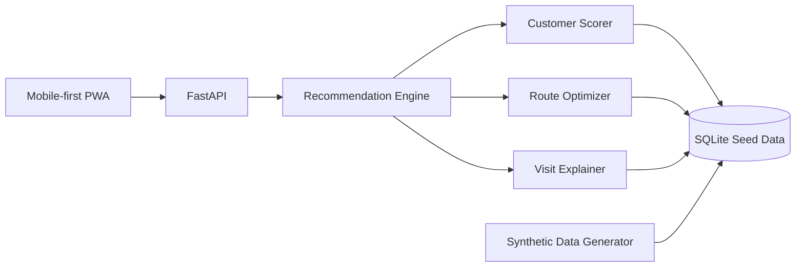

# Implementation Plan: AI Day Planner

## Stack

- Frontend: React, TypeScript, Vite, Tailwind CSS, MapLibre GL, PWA manifest/service worker.
- Backend: Python, FastAPI, SQLite, Pydantic.
- AI/optimization: heuristic scorer first, optional XGBoost upgrade, OR-Tools for route optimization.
- Data: synthetic Kuala Lumpur customer/customer-history dataset.

## Architecture

## Build Order

1. Spec and project scaffold.
2. Synthetic data generator and SQLite seed.
3. Customer scoring module.
4. Route optimization module.
5. Recommendation engine and FastAPI contract.
6. Mobile-first PWA pages.
7. Demo polish and reset flow.

## Risk Controls

- If OR-Tools setup is slow, use a nearest-neighbor route fallback.
- If ML training is slow, ship the weighted heuristic scorer.
- If offline PWA setup is slow, ship responsive web and keep PWA as stretch.
- If map tile access is unreliable, render route cards as the fallback demo path.
